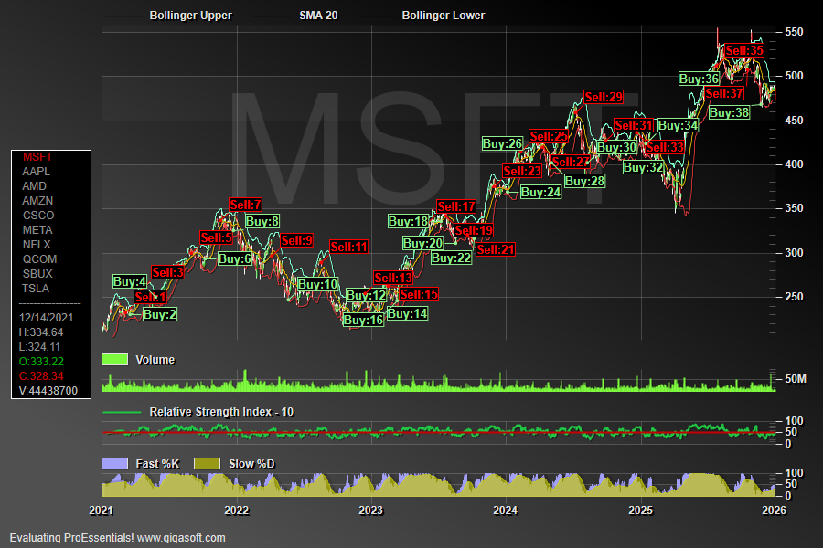

# ProEssentials WPF Financial OHLC Chart — Trading Signal Generation

A ProEssentials v10 WPF .NET 8 demonstration of a full-featured financial 
charting application with OHLC candlesticks, technical studies, and 
custom trading signal annotations across 10 real stock symbols.



---

## What This Demonstrates

This is a self-contained WPF implementation of 
**Example 030 — Table Annotations, Hot Spots** from the ProEssentials 
library, extended into a complete financial charting application.

➡️ [gigasoft.com/examples/030](https://gigasoft.com/examples/030)

### Four Synchronized Chart Axes

| Axis | Content | Height |
|------|---------|--------|
| **Price** | OHLC candlesticks + Bollinger Bands + SMA 20 | 70% |
| **Volume** | Volume bars | 10% |
| **RSI** | Relative Strength Index (10-day) | 10% |
| **Stochastic** | Custom Fast %K and Slow %D | 10% |

### Technical Studies Calculated

- **Bollinger Bands** — 20-day SMA with upper and lower bands (±2σ)
- **RSI** — Relative Strength Index, 10-day smoothed
- **Custom Stochastic Oscillator** — 30-day window, 15-day D-period with 
  tuned parameters (not a standard textbook stochastic)

### Buy/Sell Signal Logic

The signal generation detects turning points in the Slow %D stochastic 
using a 7-point lookahead window:

```csharp
// Sell: steep downward slope from overbought territory
if (fDif < -6.0F && Pego1.PeData.Y[10, pnt] > 60.0F)
    // → Sell signal annotation

// Buy: direction reverses upward from downtrend
if (fDif > 0)
    // → Buy signal annotation
```

The tuned parameters — 30-day window, 15-day D-period, 7-point 
lookahead, -6.0 slope threshold, 60.0 overbought floor — produce 
signals that **could serve as input features to an AI/ML trading 
or decision support system**. This is not an AI system itself — 
it demonstrates how technical analysis signal generation can be 
implemented in C# as a data pipeline stage.

---

## Portfolio — 10 Symbols Included

Real historical daily OHLCV data included as CSV files:

`MSFT` `AAPL` `AMD` `AMZN` `CSCO` `META` `NFLX` `QCOM` `SBUX` `TSLA`

Click any symbol in the left panel to switch — data reloads and all 
studies and signals are recalculated instantly.

---

## Interactive Features

- **Left panel** — clickable stock symbol selector (table annotation hot spots)
- **Hover** — live OHLCV data shown in the left panel (Date, H, L, O, C, V)
- **Tooltip** — formatted OHLCV on mouse hover
- **Click candlestick** — enables arrow-key cursor navigation
- **Left-click drag** — zoom box
- **Mouse wheel** — horizontal zoom
- **Pinch gesture** — zoom (touch screen)
- **Right-click** — full context menu
- **ZoomWindow** — overview panel showing current view position
- **Y-axis auto-scale** — price axis rescales as you pan/zoom
- **Drag axis borders** — resize individual axis proportions

---

## ProEssentials Features Demonstrated

**Table Annotation Hot Spots** — table annotation cells become 
interactive UI elements. Clicking a symbol triggers a 
`PeTableAnnotation` event that reloads data for the new symbol.

**`DrawTable(0)`** — lightweight partial redraw that updates only 
the table annotation without redrawing the full chart — used in 
MouseMove to update OHLCV data at 60fps without chart flicker.

**`ConvPixelToGraph()`** — converts mouse pixel coordinates to 
chart data coordinates, used to identify the nearest data point 
under the cursor.

**Date/time axis** — serial date handling with `DateTimeMode`, 
`DeltasPerDay`, and `DeltaX = -1` for daily data.

**`SpecificPlotMode.BoxPlot`** — renders the OHLC data as 
candlesticks using the High/Low/Open/Close subsets.

**`PeCustomTrackingDataText`** — custom tooltip content event 
for formatted multi-line OHLCV display.

---

## Prerequisites

- Visual Studio 2022
- .NET 8 SDK
- Internet connection for NuGet restore

> **Designer Support:** Visual Studio designer requires the full 
> ProEssentials installation. The project builds and runs correctly 
> via NuGet without a full installation.

---

## How to Run

```
1. Clone this repository
2. Open FinancialOhlcChart.sln in Visual Studio 2022
3. Build → Rebuild Solution (restores NuGet package automatically)
4. Press F5
5. Click any stock symbol in the left panel to switch symbols
```

---

## NuGet Package

This project references 
[`ProEssentials.Chart.Net80.x64.Wpf`](https://www.nuget.org/packages/ProEssentials.Chart.Net80.x64.Wpf) 
from nuget.org. Package restore happens automatically on build.

---

## Related

- [WPF Quickstart — Simple Scientific Graph](https://github.com/GigasoftInc/wpf-chart-quickstart-proessentials)
- [GigaPrime2D WPF — 100 Million Points](https://github.com/GigasoftInc/wpf-chart-fast-100m-points-proessentials)
- [GigaPrime3D — 3D Surface Height Map](https://github.com/GigasoftInc/wpf-chart-3d-surface-proessentials)
- [No-hassle evaluation download](https://gigasoft.com/net-chart-component-wpf-winforms-download)
- [gigasoft.com](https://gigasoft.com)

---

## License

Example code is MIT licensed. ProEssentials requires a commercial 
license for continued use.
